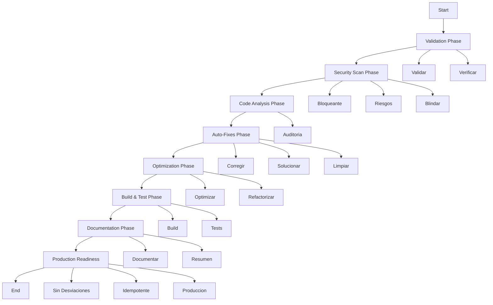

# 🏗️ Architecture Documentation

## Sistema Imperial de 29 Agentes Git Automatizados

### Visión General

Este sistema implementa una arquitectura modular y escalable basada en principios SOLID y Clean Code, con 29 agentes especializados organizados en 6 categorías principales.

## 📐 Principios de Diseño

### SOLID Principles

1. **Single Responsibility**: Cada agente tiene una responsabilidad única y bien definida
2. **Open/Closed**: Los agentes son abiertos para extensión pero cerrados para modificación
3. **Liskov Substitution**: Todos los agentes heredan de BaseAgent y son intercambiables
4. **Interface Segregation**: Interfaces específicas para cada tipo de agente
5. **Dependency Inversion**: Dependencias abstraídas a través de BaseAgent

### Clean Code Principles

- Nombres descriptivos y auto-explicativos
- Funciones pequeñas y enfocadas
- Comentarios solo cuando añaden valor
- Manejo de errores robusto
- DRY (Don't Repeat Yourself)

### Design Patterns

- **Strategy Pattern**: Diferentes estrategias de ejecución por agente
- **Factory Pattern**: Creación de agentes e instancias
- **Observer Pattern**: Sistema de logging y métricas
- **Chain of Responsibility**: Flujo de ejecución de workflows
- **Command Pattern**: Encapsulación de acciones de agentes

## 🏛️ Arquitectura de Capas

```
┌─────────────────────────────────────────────────────────┐
│                    Application Layer                     │
│            (GitAutomationSystem - index.js)              │
└─────────────────────────────────────────────────────────┘
                            │
        ┌───────────────────┼───────────────────┐
        │                   │                   │
┌───────▼────────┐  ┌──────▼──────┐  ┌────────▼────────┐
│   Workflow     │  │   Agent     │  │   Execution     │
│    Engine      │  │ Coordinator │  │    Planner      │
└───────┬────────┘  └──────┬──────┘  └────────┬────────┘
        │                   │                   │
        └───────────────────┼───────────────────┘
                            │
            ┌───────────────┴───────────────┐
            │      Orchestrator Layer       │
            └───────────────┬───────────────┘
                            │
        ┌───────────────────┼───────────────────┐
        │                   │                   │
┌───────▼────────┐  ┌──────▼──────┐  ┌────────▼────────┐
│  Core Review   │  │ Development │  │    Security     │
│  (6 agents)    │  │  (7 agents) │  │   (3 agents)    │
└────────────────┘  └─────────────┘  └─────────────────┘
        │                   │                   │
┌───────▼────────┐  ┌──────▼──────┐  ┌────────▼────────┐
│ Documentation  │  │Transformation│  │   Production    │
│  (4 agents)    │  │  (5 agents) │  │   (4 agents)    │
└────────────────┘  └─────────────┘  └─────────────────┘
        │                   │                   │
        └───────────────────┼───────────────────┘
                            │
            ┌───────────────▼───────────────┐
            │       Shared Layer            │
            │  (BaseAgent, Utils, Config,   │
            │   Logger, Metrics, Constants) │
            └───────────────────────────────┘
```

## 🧩 Componentes Principales

### 1. BaseAgent (Clase Base)

Todos los agentes heredan de esta clase base que proporciona:

- **Lifecycle Management**: Inicialización, ejecución, cleanup
- **Logging**: Sistema de logging integrado
- **Metrics**: Recolección de métricas automática
- **Configuration**: Gestión de configuración
- **Error Handling**: Manejo robusto de errores
- **Validation**: Validación de pre-condiciones
- **Auto-fix**: Capacidad de auto-corrección

```javascript
class BaseAgent {
  constructor(config)
  async execute(context)      // Implementado por subclases
  async validate(context)
  async getRecommendations(result)
  async autoFix(issues)
  async run(context)           // Wrapper con métricas
}
```

### 2. WorkflowEngine (Motor de Workflows)

Gestiona la ejecución de workflows complejos:

- **Workflow Registration**: Registro de workflows
- **Stage Execution**: Ejecución secuencial/paralela de stages
- **Dependency Resolution**: Resolución de dependencias entre stages
- **Error Recovery**: Recuperación de errores
- **Results Aggregation**: Agregación de resultados

```javascript
class WorkflowEngine {
  registerWorkflow(workflow)
  async execute(workflowName, context)
  getWorkflow(name)
  listWorkflows()
}
```

### 3. AgentCoordinator (Coordinador)

Orquesta la ejecución de múltiples agentes:

- **Agent Registry**: Registro de agentes disponibles
- **Parallel Execution**: Ejecución paralela con límite de concurrencia
- **Sequential Execution**: Ejecución secuencial ordenada
- **Resource Management**: Gestión de recursos
- **Metrics Collection**: Recolección de métricas globales

```javascript
class AgentCoordinator {
  registerAgent(agent)
  async executeWorkflow(workflow, context)
  async _executeStage(stage, context)
  getMetrics()
}
```

### 4. ExecutionPlanner (Planificador)

Crea planes de ejecución inteligentes:

- **Context Analysis**: Análisis del contexto
- **Agent Selection**: Selección inteligente de agentes
- **Phase Organization**: Organización en fases
- **Optimization**: Optimización del plan
- **Time Estimation**: Estimación de tiempo de ejecución

```javascript
class ExecutionPlanner {
  async createPlan(context, availableAgents)
  optimizePlan(plan)
  validatePlan(plan)
}
```

## 📦 Categorías de Agentes

### 1. Core Review (Categoría Crítica)

**Propósito**: Revisión y análisis fundamental del código

- **Auditoria**: Auditoría completa (AST, seguridad, rendimiento)
- **Validar**: Validación de estándares y convenciones
- **Verificar**: Verificación de CI/CD y deployments
- **Corregir**: Correcciones automáticas
- **Solucionar**: Resolución de issues
- **Refactorizar**: Aplicación de patrones de refactoring

**Flujo de Ejecución**:
```
Validar → Verificar → Auditoria → Corregir → Solucionar → Refactorizar
```

### 2. Development (Categoría Crítica)

**Propósito**: Desarrollo y optimización

- **Build**: Optimización de build y bundles
- **Pipeline**: Generación de CI/CD pipelines
- **Tests**: Generación y análisis de tests
- **Optimizar**: Optimización de rendimiento
- **Limpiar**: Limpieza de código
- **Depurar**: Debugging y análisis de errores
- **Scripts**: Generación de scripts de automatización

**Flujo de Ejecución**:
```
Limpiar → Build → Tests → Optimizar → Pipeline → Scripts
```

### 3. Security (Categoría Crítica)

**Propósito**: Seguridad y protección

- **Bloqueante**: Detección de vulnerabilidades críticas
- **Riesgos**: Análisis de riesgos y threat modeling
- **Blindar**: Hardening y encriptación

**Flujo de Ejecución**:
```
Bloqueante → Riesgos → Blindar
```

### 4. Documentation (Categoría Alta)

**Propósito**: Documentación y reporting

- **Documentar**: Generación de documentación técnica
- **Reporte Técnico**: Reportes detallados
- **Resumen**: Resúmenes y release notes
- **Checklist**: Checklists de calidad

**Flujo de Ejecución**:
```
Documentar → Reporte Técnico → Resumen → Checklist
```

### 5. Transformation (Categoría Media)

**Propósito**: Transformación y migración

- **Actualizar**: Actualización de dependencias
- **Migrar**: Migración de tecnologías
- **Adaptar**: Adaptación a estándares
- **Reemplazar**: Reemplazo de código legacy
- **Cambiar**: Gestión de cambios

### 6. Production (Categoría Crítica)

**Propósito**: Preparación para producción

- **Sin Desviaciones**: Enforcement de compliance
- **Idempotente**: Validación de idempotencia
- **Produccion**: Readiness checks
- **Trabajar**: Orquestador maestro

## 🔄 Flujo de Ejecución

### Workflow Completo



### Ejecución Paralela vs Secuencial

**Paralela**: Cuando los agentes no tienen dependencias
```
[Validar]  [Verificar]  [Bloqueante]
    ↓          ↓            ↓
    └──────────┴────────────┘
              ↓
         [Continue]
```

**Secuencial**: Cuando hay dependencias
```
[Auditoria] → [Corregir] → [Solucionar] → [Refactorizar]
```

## 📊 Sistema de Métricas

### Métricas por Agente

- Número de ejecuciones
- Tasa de éxito
- Tiempo promedio de ejecución
- Errores encontrados
- Correcciones aplicadas

### Métricas del Sistema

- Total de agentes ejecutados
- Tasa de éxito global
- Tiempo total de ejecución
- Carga de trabajo por categoría

## 🔧 Extensibilidad

### Crear un Nuevo Agente

```javascript
const BaseAgent = require('./shared/base-agent');
const { CATEGORY, PRIORITY } = require('./shared/constants');

class MiNuevoAgent extends BaseAgent {
  constructor(config = {}) {
    super({
      name: 'MiNuevo',
      version: '1.0.0',
      category: CATEGORY.DEVELOPMENT,
      priority: PRIORITY.HIGH,
      description: 'Mi agente personalizado',
      ...config
    });
  }

  async execute(context) {
    // Implementación del agente
    return { success: true };
  }
}

module.exports = MiNuevoAgent;
```

### Registrar el Agente

```javascript
const system = new GitAutomationSystem();
const miAgente = new MiNuevoAgent();
system.engine.getCoordinator().registerAgent(miAgente);
```

## 🎯 Best Practices

1. **Cada agente debe tener una sola responsabilidad**
2. **Siempre validar el contexto antes de ejecutar**
3. **Registrar métricas para monitoreo**
4. **Proporcionar recomendaciones accionables**
5. **Implementar auto-fix cuando sea posible**
6. **Manejar errores de forma robusta**
7. **Documentar comportamiento esperado**

## 🔐 Certificaciones Aplicadas

- **ISO/IEC 25010**: Calidad de software
- **OWASP Top 10**: Seguridad web
- **Clean Code**: Código limpio
- **SOLID**: Principios de diseño
- **DevOps**: Mejores prácticas CI/CD

---

**Arquitectura: IMPERIAL PREMIUM ELITE 👑**
